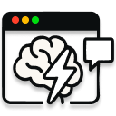

# Perplexity Browser Companion



## Overview

Perplexity Browser Companion is a Chrome extension that provides an AI assistant powered by the Perplexity Sonar API. It integrates directly into your browser as a side panel, allowing you to interact with AI while browsing the web.

## Features

- **Browser Side Panel Integration**: Access the AI assistant directly from your browser's side panel
- **Text Selection Analysis**: Select text on any webpage and send it to the AI assistant with a keyboard shortcut (Ctrl+Shift+X)
- **Context-Aware Interactions**: Right-click menu integration for contextual AI assistance
- **Markdown Support**: View AI responses with proper formatting including code blocks and tables
- **Persistent Storage**: Conversation history is saved between sessions

## Installation

### From Source

1. Clone the repository:
```bash
git clone https://github.com/meoawww/perplexity-hackathon.git
```

2. Install dependencies:
```bash
npm install
```

3. Build the extension:
```bash
npm run build
```

4. Load the extension in Chrome:
   - Open Chrome and navigate to `chrome://extensions/`
   - Enable "Developer mode" in the top-right corner
   - Click "Load unpacked" and select the `dist` directory from the project

### Development

To run the extension in development mode:

```bash
npm run dev
```

## Usage

1. **Open the Side Panel**: Click on the extension icon in your browser toolbar to open the Perplexity Browser Companion side panel
2. **Configure Settings**: Click on the settings icon in the side panel to configure the extension's settings to enter Perrplexity API key and choose your preferred theme mode.
3. **Converse with Perplexity**: Select any sonar modal that perplexity supports and select text on a webpage to send to AI for context or directly ask questions.


## Tech Stack

- **Frontend**: React, TypeScript, Tailwind CSS
- **UI Components**: Radix UI
- **Markdown Rendering**: react-markdown with remark-gfm and rehype-raw
- **Build Tools**: Vite, esbuild
- **Extension Framework**: Chrome Extension Manifest V3
- **AI API**: Perplexity Sonar API

## Permissions

This extension requires the following permissions:
- `activeTab`: To access the current tab's content
- `storage`: To save conversation history and settings
- `sidePanel`: To create a browser side panel
- `contextMenus`: To add options to the right-click menu
- `scripting`: To inject scripts for capturing selected text

## Acknowledgements

- Powered by [Perplexity Sonar API](https://www.perplexity.ai/)
- Built during the Perplexity Hackathon